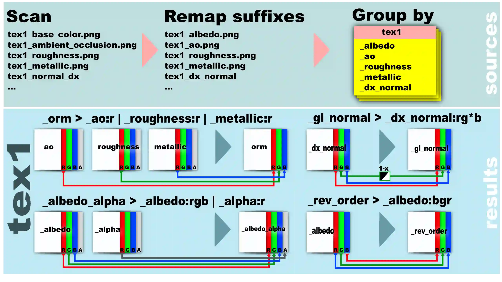

# texture-packer
Texture channel packer tool for automate creating material maps for game engines

## Problem
In Substance designer/painter you might customize channel layout and format for every output texture, but images, downloaded from Textures.com, TextureHaven and other services has various naming, channel layout (orm textures, separate ao, roughness, metallic, height (8 or 16-bits) textures, height in the alpha channel of albedo or in normal texture, DX normals, GL normals ... tens of variants). It takes a lot of time to manually create the necessary (for specified game engine) texture maps from all of this.

### Situation:
<table>
<thead style="vertical-align:text-top;">
  <tr>
    <th>Let's say you have a lot of textures like this:</th>
    <th>In you workflow need something this:</th>
    <th>Comment</th>
  </tr>
</thead>
<tbody style="vertical-align:text-top;">
  <tr>
    <td>
        <p>tex1_Base_Color.png</p>
        <p>tex1_DX_Normal.tiff</p>
        <p>tex1_Ambient_Occlusion.jpg</p>
        <p>tex1_Roughness.png</p>
        <p>tex1_Metallic</p>
        <p>some_random_file.txt</p>
        <p>tex2_Color.jpg</p>
        <p>...</p>
        <p>texN_Color</p>
        <p>texN_DX_Normal.png</p>
        <p>texN_Smoothness.png</p>
        <p>texN_Metallic.png</p>
    </td>
    <td>
        <p>tex1_albedo.png</p>
        <p>tex1_GL_normal.png</p>
        <p>tex1_orm.png</p>
        <p>...</p>
        <p>texN_albedo.png</p>
        <p>texN_GL_normal.png</p>
        <p>texN_orm.png</p>
    </td>
    <td>
    Where:<br>
    _GL__normal is _DX_normal with inverted green channel<br>
    _Smoothnes is inverted _Roughness (welcome to Unity engine)<br>
    _Orm is compound map with channels (R  = _Ambient_Occluion, G = _Roughness, B = _Metallic
    </td>
  </tr>
</tbody>
</table>

The texture packer will create everything you need in batch mode, based on the names and suffixes of the images

## How it works
Tl. dr, like this: scan files in src_dir -> remap suffixes ->group by [group name] and suffixes -> pack -> save to dest_dir

### Concepts
There are 3 parts in the file name: group name, suffix, extension.

For: __tex1_Normal.png__
| Group name | Suffix | Extension |
|---|---|---|
| tex1 | _Normal | .png |

> In the config.txt you may be described all suffixes and file extensions, will scanned by packer.

1. The texture packer gets a list of files with the required extension and suffixes.
    1. Converts texture suffixes to a uniform look (as described in the config)
    1. Groups them by [group name] and suffix.
2. Creates new textures from them with the desired channel layout for each group. 

The output is textures with the same group name and a new suffix that corresponds to the channel layout (as described in the config)

## Config
Config is a simple txt file with sections (as in ini file).

### Settings section
 * "#" - comment as in python
 * ">" - key - value seprator, same as "=" in ini

```
[settings]

# assign test-data/src to src_dir
src_dir > test-data/src 

dest_dir > test-data/dest

save_relativepaths > false

# lowercase names at saving
lowercase_names > true

# save textures in PNG
output_format > png

```

### filters section
```
.png
.jpg
.tga
```
Determines file extensions to process. One extension per line.

### Map suffixes section

Only files with suffixes, described in this section will be processed. 
Also, you may be specify suffixes remaps. (for example: **_Base_Color > _albedo** means that file with suffix "_Base_Color" will threated as "_albedo")
```
[map suffixes]
# _color threated as _albedo
_color > _albedo

# _base_color threated as _albedo
_base_color > _albedo

# everything else doesn`t need to be remap
_albedo
_normal
_roughness
_metallic
_ao
_height
```

### Pack section

All the fun begins here. Here you may describe output textures suffixes and them layouts. 

Syntax of pack sequence: **_result > _suf1:x | _suf2:x | _suf3:x | suf4:x** where x - channel name (r,g,b,a)
* ">"  - separate new texture suffix (left side) and channel pack stack (right side)
* "|" - pipeline separator - separate different source textures in sequence
* ":" - separate source texture suffix (left) and channel names to pack (right)

Source channels are pushed onto the stack from left to right (r->g->b->a) and packs to output texture.


> NB! One line - one output texture.


Let's say you have a *group* of textures: **texname [_ao, _roughness, _metallic, _normal, _albedo, _alpha]**

Possible lines: 
* **_orm > _ao:r | _roughness:r | _metallic:r** - produces "texname_orm" with 3 channel (r from r channel of "texname_ao", g from r channel "texname_roughness" and b from r channel of "texname_metallic").
* **_normal_gl > _normal_dx:rg*b** -  produces "texname_normal_gl" with inverted g channel from "texname_normal".
* **_albedo_w_alpha: _albedo:rgb | _alpha:r** - produces "texname_albedo_w_alpha" from r, g and b channels from "texname_albedo" and r channel of "texname_alpha").
* **_inv_order: _albedo:bgr** - produces texture "texname_inv_order" with inverted order of channels.

> " \* " character after channel inverts it ( _normal_gl > _normal_dx:rg*b inverts green channel for mytexture_normal.png if tool found it)

## Dependencies
To work with texture_packer need python modules: Pillow, Numpy (for working with 16-bit gray input textures)
```python
pip install pillow
pip install numpy
```

## Run

Run from command line.
```cmd
python texture_packer.py [-h] [-c CONFIG] [-s SRC_DIR] [-d DEST_DIR] [-o {png,jpg,bmp,tiff,tga,dds}]

options:
  -h, --help            show this help message and exit
  -c CONFIG, --config CONFIG
                        Path to config (relative cwd or absolute). Default 'config.txt' in cwd
  -s SRC_DIR, --src SRC_DIR
                        Path to directory with source textures (relative cwd or absolute)
  -d DEST_DIR, --dest DEST_DIR
                        Path to destination directory (relative cwd or absolute)
  -o {png,jpg,bmp,tiff,tga,dds}, --output-format {png,jpg,bmp,tiff,tga,dds}
                        Output format
```
If -config not defined, packer tries to find config.txt in cwd, if not found, (currently) works with hardcoded test config

## Restrictions
* All textures with same group name must be the same size. Up/downscale not supported. (currently)

## Known issues
* Conversion from 16 to 8 bit gray is not 100% accurate, although difference is not visible in a 1:1 comparison with same image, manually created in graphic editor (Krita), but the histograms are slightly different. Conversion 16bit gray to 8bit gray through Image.convert(mode) not working in Pillow [#3011](https://github.com/python-pillow/Pillow/issues/3011), used workaround.

## Disclaimer
This tool was quickly written for specific tasks and works well for my workflow. Despite this, I will try to refine, fix bugs, improve the code (yes, the code is bad, but it works and saves me a lot of time)